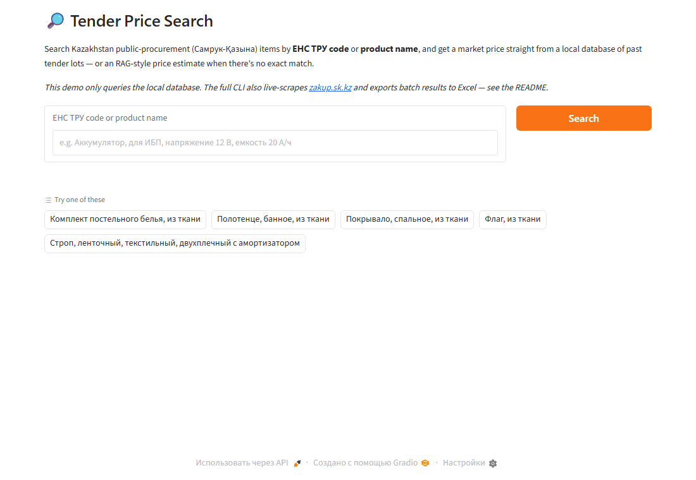

🇬🇧 [Read in English](README.md)

# Tender Price Search

Поиск рыночной цены товаров из государственных закупок Казахстана (Самрук-Қазына / [zakup.sk.kz](https://zakup.sk.kz)) по коду **ЕНС ТРУ** или **названию товара** — из локальной базы прошлых лотов, живым поиском на портале, либо прогнозом цены на основе регрессии, если точного совпадения нет.

Решает частый вопрос закупщика: *«а по адекватной ли цене куплена эта позиция?»*



## Как это работает

Каждый запрос проходит через 3 уровня:

1. **Локальная база** — мгновенный поиск по коду ЕНС ТРУ или нечёткому текстовому/числовому совпадению по `data/out_with_prices.json` (TF-IDF + русская морфология через `pymorphy2`, плюс сопоставление числовых характеристик — напряжение, ёмкость, сечение кабеля и т.п.).
2. **Живой поиск на сайте** *(только CLI)* — если в базе ничего нет, headless-браузер (Playwright) ищет подходящие лоты на [zakup.sk.kz](https://zakup.sk.kz), скачивает PDF технической спецификации, парсит его и сохраняет результат в локальную базу для следующих запросов.
3. **RAG-подобный прогноз цены** — если и на сайте пусто, линейная регрессия по товарам той же категории (сопоставленным по числовым характеристикам) даёт оценку цены с confidence-score на основе числа точек, качества регрессии (R²) и согласованности цен.

Также есть **batch-режим для Excel**: загружаешь таблицу тендерных позиций — получаешь её обратно с добавленными колонками рыночной цены, статуса и уверенности, с цветовой заливкой по статусу **Переплата / Нормально / Ниже рынка** (сравнение фактической цены закупки с найденной рыночной).

## Запуск

Веб-интерфейс (`app.py`) использует только уровни 1 и 3 — работает read-only по локальной базе, поэтому безопасен для публичного запуска (не долбит портал закупок). Полный трёхуровневый пайплайн (включая живой скрапинг и batch-режим Excel) доступен только через CLI.

```bash
pip install -r requirements.txt
playwright install chromium   # нужно только для живого поиска на сайте (CLI)

python app.py                 # веб-интерфейс — http://127.0.0.1:7860
python -m tender_search       # интерактивный CLI (все 3 уровня)
```

Batch-режим через CLI:

```bash
python -m tender_search --batch-excel input.xlsx --output results.xlsx \
    --col-name 4 --col-unit 7 --col-actual-price 15
```

## Структура проекта

```
tender_search/            # основной пакет (без веб/CLI-специфичного кода)
  database.py               JSON-хранилище, индекс по lot_id / ЕНС ТРУ
  search_engine.py           TF-IDF + морфология + числовые характеристики, прогноз цены
  zakup_client.py             Playwright-сессия для zakup.sk.kz
  pdf_parser.py                 парсинг PDF тех.спецификации в структурированные поля
  orchestrator.py                3-уровневый пайплайн запроса (TenderSearchSystem)
  excel_export.py                 batch-чтение/запись Excel с цветовой заливкой статуса
  price_status.py                  классификация Переплата / Нормально / Ниже рынка
  cli.py                            REPL + argparse точка входа
app.py                    # Gradio веб-интерфейс (только уровни 1 и 3)
scripts/make_demo_gif.py  # пересоздаёт docs/demo.gif
```

## Лицензия

MIT
